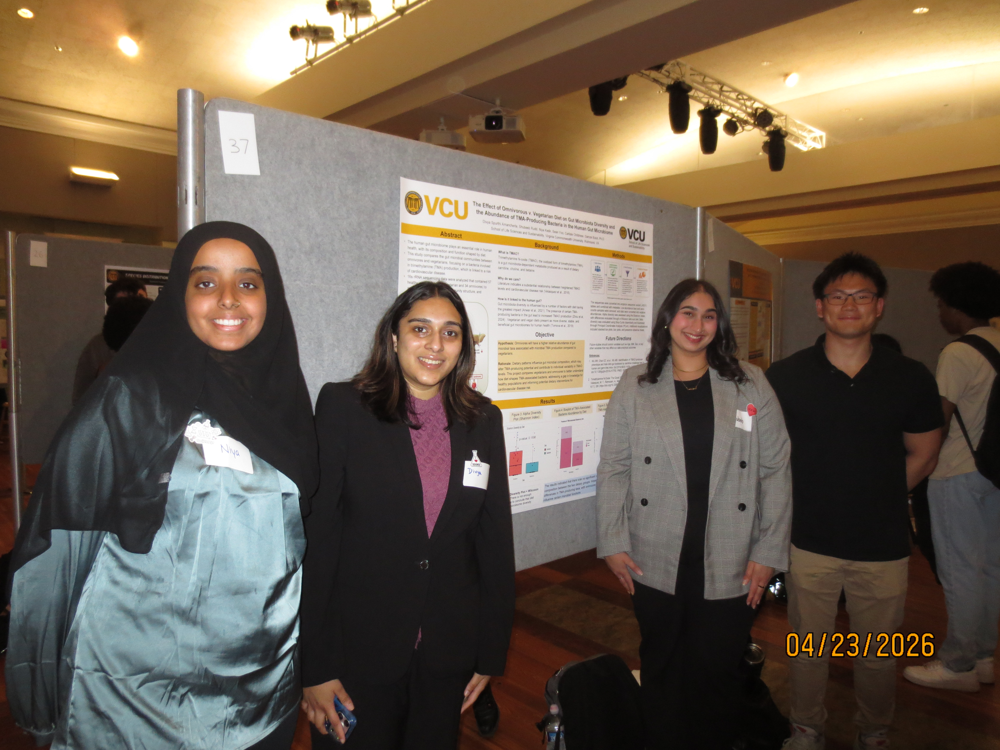

## Members
- Divya Spurthi Amancherla: EDA, data cleaning, data modeling
- Shubeeb Rudd: Github & Quarto, data aquisition, final figure generation
- Niya Kedir: supplemental research,  writing, final figure generation
- Sean Yoo: supplemental data analysis,  writing, final figure generation
